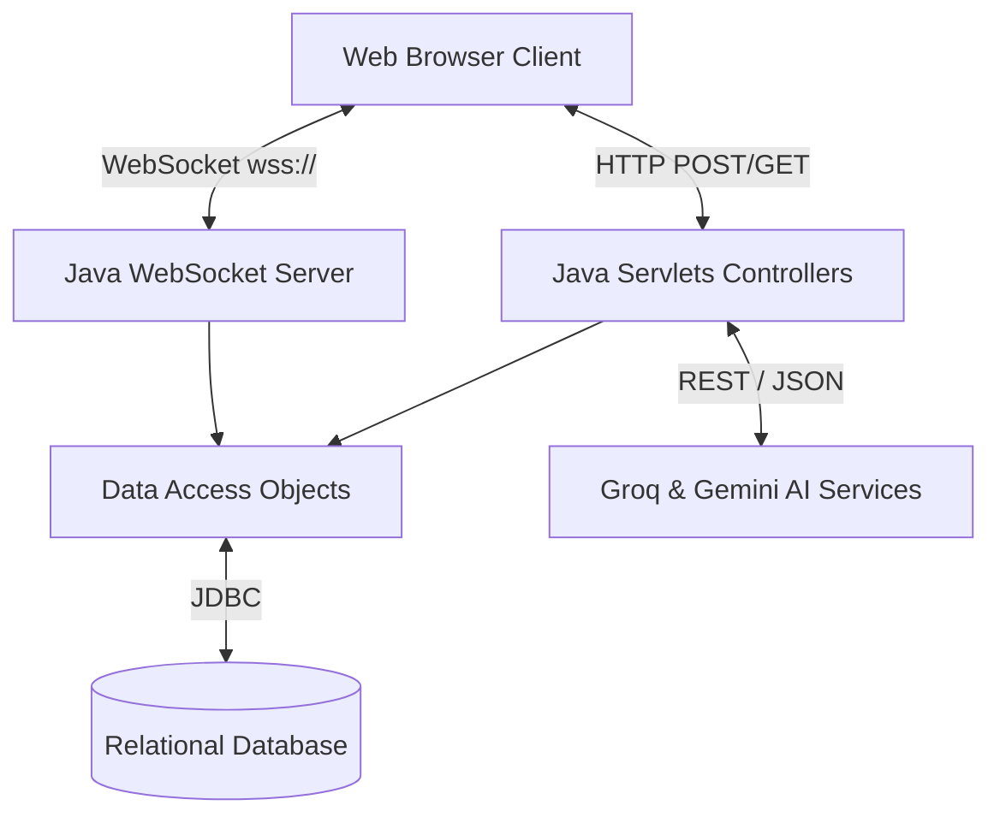

<div align="center">

  
  
  
  
  
  <h1>🌟 EchoSphere | Enterprise Java Chat System</h1>
  
  <p><b>A highly scalable, real-time Full-Stack Java Application built with MVC Architecture, WebSockets, and AI Integrations.</b></p>

  <a href="https://chat-system-live.onrender.com/login.jsp" target="_blank">
    
  </a>

</div>

<br/>

## 🎯 Project Overview

**EchoSphere** is a sophisticated, full-stack enterprise Java application engineered to highlight modern backend development capabilities. Designed from the ground up using **Java Servlets**, **JSP**, and pure **JDBC**, it demonstrates a deep understanding of core web technologies without relying heavily on abstract frameworks like Spring Boot. 

By implementing the **MVC (Model-View-Controller)** paradigm and **DAO (Data Access Object)** design patterns, the application ensures clean separation of concerns, secure data handling, and highly maintainable code. The integration of **Java WebSockets API** elevates the project beyond standard HTTP request/response lifecycles, enabling 0-latency bi-directional data streaming.

### 💼 Why this stands out for a Full Stack / Backend Role:
- **Architectural Discipline:** Strict adherence to MVC and DAO patterns.
- **Real-Time Data Streaming:** Leverages `javax.websocket` for real-time messaging, rather than standard HTTP polling.
- **RESTful Third-Party Integrations:** Implements asynchronous HTTP/REST calls to Google Gemini and Groq APIs for Gen-AI features.
- **Database Engineering:** Custom JDBC transaction management mapped to robust relational database schemas.

---

## ✨ Core Features

- ⚡ **Real-Time WebSocket Communication:** Bi-directional event-driven architecture allowing instant message delivery for 1-on-1 and Group chats.
- 🤖 **AI Chat Summarization (Google Gemini):** Automatically compiles long group discussions into short, actionable bullet points using LLMs.
- 🌍 **Instant Multilingual Translation (Groq):** Real-time text translation utilizing high-speed AI inference for cross-border communication.
- 🔐 **Secure Authentication System:** Enterprise-grade login and registration protocols with secure session management.
- 📁 **Multimedia Support:** Integrated I/O streams allowing secure image, file, and voice-note base64 encoded data transfers.

---

## 🛠️ Technology Stack

| Layer | Tools & Technologies |
| :--- | :--- |
| **Backend Core** | Java 20, Java EE Servlets, Filter APIs |
| **Real-time Protocol** | Java WebSocket API (`@ServerEndpoint`) |
| **Frontend/Views** | JSP (JavaServer Pages), HTML5, CSS3, JavaScript (ES6) |
| **Database Layer** | MySQL / PostgreSQL, Raw JDBC, DAO Design Pattern |
| **Cloud & APIs** | Google Gemini (Gen AI), Groq API (Translation Model) |
| **Server Engine** | Apache Tomcat 9.0 |

---

## 🏗️ Architecture Design (High-Level)




---

## 🚀 Getting Started Locally

### Prerequisites
- JDK 20 or higher installed.
- Apache Tomcat 9 Server.
- A relational database (MySQL/PostgreSQL) running locally.

### Installation & Setup

1. **Clone the repository**
   ```bash
   git clone https://github.com/khemanth11/EchoSphere.git
   cd EchoSphere
   ```

2. **Configure the Database**
   - Import the required SQL schemas.
   - Navigate to `src/main/java/com/chat/config/DBConnection.java`.
   - Update the JDBC connection string, `USER`, and `PASSWORD` to match your local setup.

3. **Configure API Keys** *(Do not push these to version control)*
   - Update `GROQ_API_KEY` in `src/main/webapp/chat.jsp`.
   - Update `API_KEY` in `src/main/java/com/chat/service/AIService.java`.

4. **Deploy Application**
   - Open in an IDE like **Eclipse Enterprise** or **IntelliJ Ultimate**.
   - Add Apache Tomcat 9 as your server.
   - Run the project on the Server. It will launch at `http://localhost:8080/ChatSystem/login.jsp`.

---

<!-- <div align="center">
  <p>Designed and Built by a Passionate Java Full Stack Engineer.</p>
</div> -->
